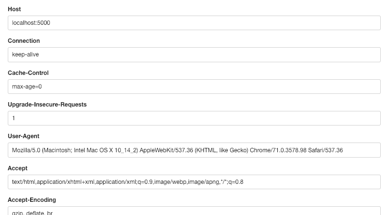

# HTTP header

[httpheader](https://httpheader.pythonanywhere.com) is a web application hosted on [pythonanywhere](https://pythonanywhere.com) to display HTTP Request headers. I build it to use it for own proxy checking and comparing headers.

On the site you will find:
- Request header
- CSS classes and ids, perfect for get scraped
- JSON API
